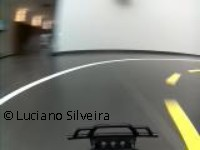
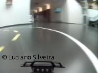
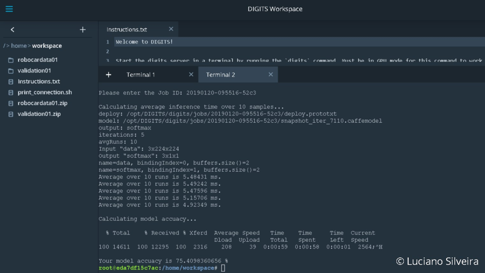
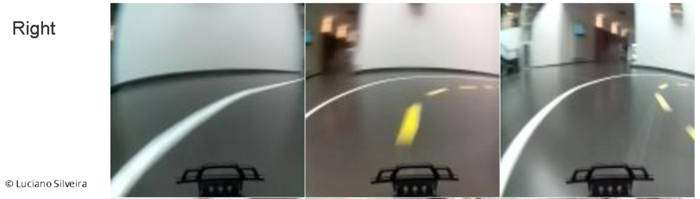
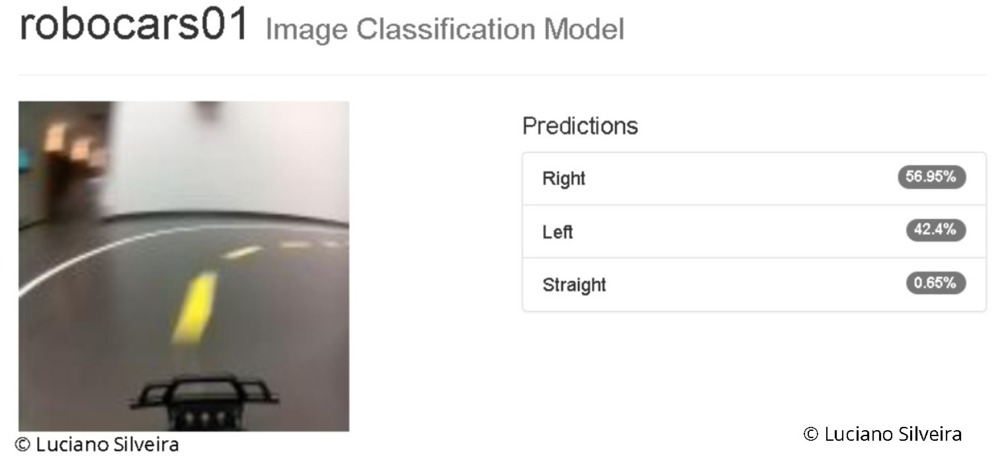
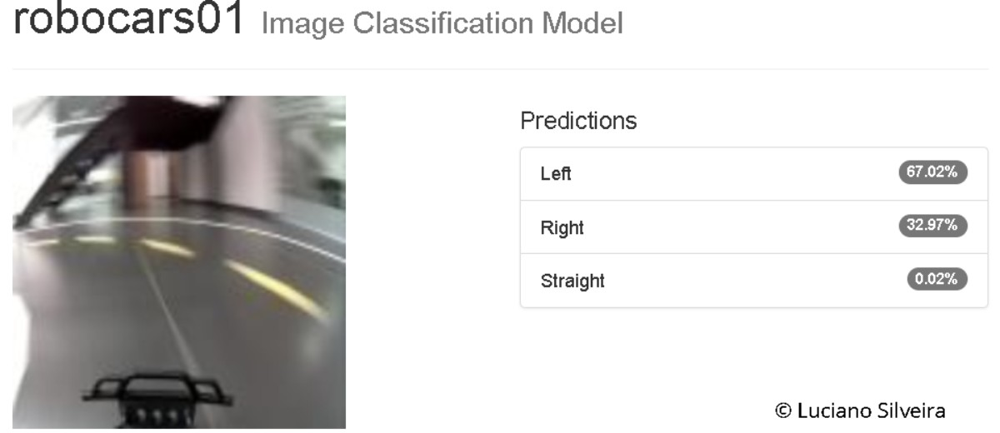
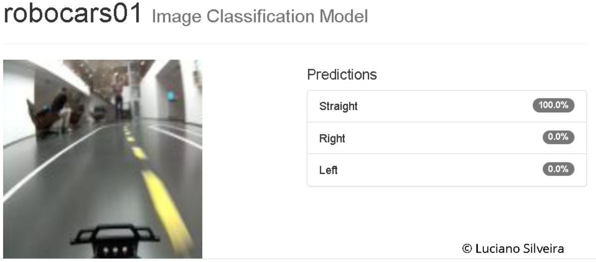
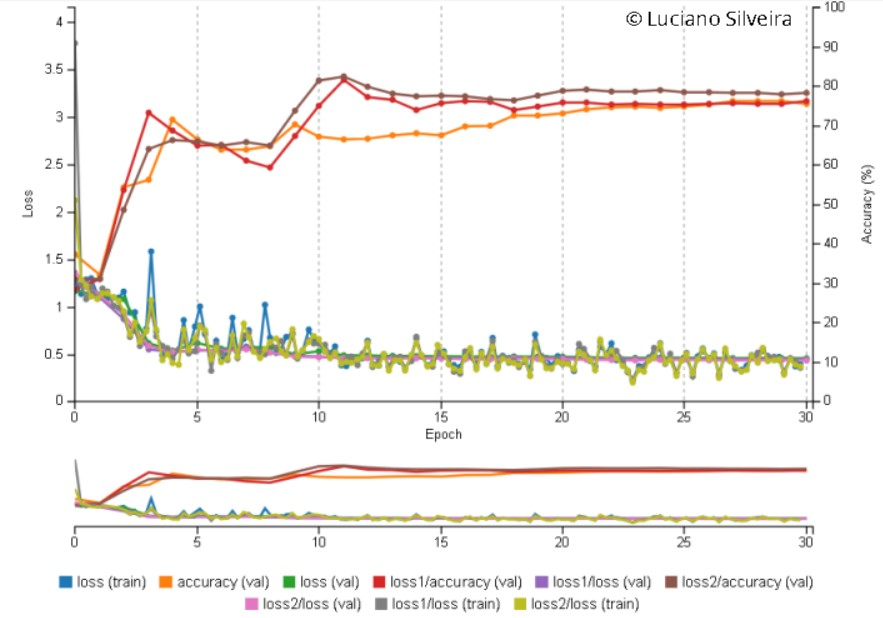
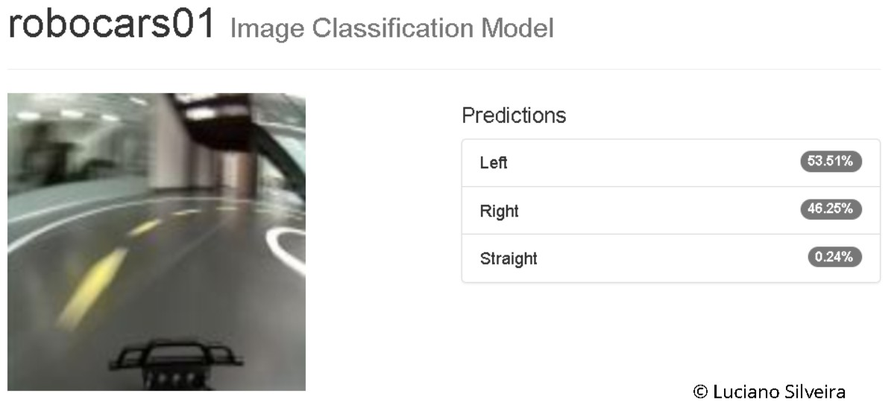
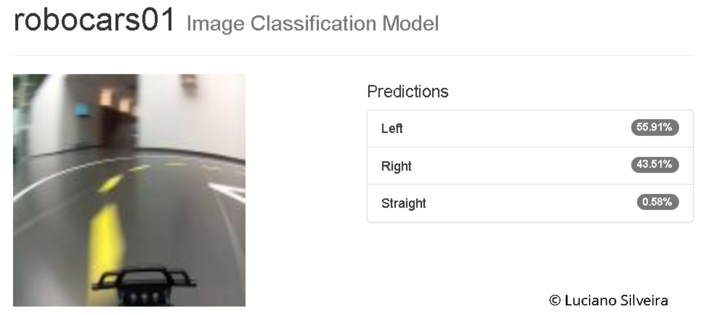

# RoboND-RoboticInference-Project-P5
Robotic Inference Udacity Project using NVIDIA Digits 6.1

## Abstract

The objective of the project is to implement a classification system for a robotic application.

It builds an inference engine extracting information from a race truck.

The data was collected using a [donkeycar2 robocar](http://www.donkeycar.com/) following a standard track.

The trained model uses [NVIDIA DIGITS](https://docs.nvidia.com/deeplearning/digits/digits-installation/index.html) infraestructure to classify if the rover needs to go: straight, turn left or right.

## Introduction

In the last few year the development of robotics applications using Machine Learning framework has exploded.

This project explores the usage of NVIDIA's DIGITS software to be used as an inference engine.

Two models where built using the software; the first one using the standard dataset provided by Udacity to get used to the software, parameters and so on. Then, another model to be used with the collected data for the specific robocar usage, a classifier to detect a robot within a truck and the possible actions to do: go `Staight`, turn `Left` or `Right`.

## Background

This project was entirely resolved using Udacity's workspace and the NVIDIA DIGITS system using [Caffe](http://caffe.berkeleyvision.org/) deep learning framework as the backend.

The first model called `Candy Boxes and Bottles` builds a classifier capable of discriminating between three classes at roughly 75% accuracy with a latency of no more than 10ms.

The second step used or own inference system on a model called `Directions` to explore possible usage on small scale robots within a known environment.

### Candy Boxes and Bottles

For the first part of the project, the images provided are 256x256 RGB images. The training was done with 30 epochs with GoogLeNet and the SGD Optimizer.

 * Model: GoogLeNet
 * Epochs: 10
 * Learning Rate: 0.01 

### Directions

Next, using GoogLenet model with same parameters was used for the second classifier. The focus was to build an inference system for identifying 3 possible classes:

 * Straight
 * Left
 * Right

## Data Acquisition

### Candy Boxes and Bottles

The data was downloaded from [here](https://s3-us-west-1.amazonaws.com/udacity-robotics/Content+Workspace+Use/lab_data.tar.gz) based on the following [comment](https://udacity-robotics.slack.com/archives/C8VHCJQ07/p1516682474000142?thread_ts=1516678960.000247) on slack.

```sh
wget https://s3-us-west-1.amazonaws.com/udacity-robotics/Content+Workspace+Use/P1_data.tar.gz
tar -xvzf /data/P1_data.tar.gz
```

The structure of the data is:


```
P1_data/
├── Bottle/
│   ├── Bottle_1.png
│   ├── Bottle_2.png
│   └── ...
├── Candy_box/
│   ├── Candy_box_1.png
│   ├── Candy_box_2.png
│   └── ...
└── Nothing/
    ├── Nothing_1.png
    ├── Nothing_2.png
    └── ...
```

For training and validation the data was automatically separated as follows:
	
**Training**

 * Bottle: 3426 images
 * Nothing: 2273 images
 * Candy Box: 1871 images

**Validation**

 * Bottle: 1142 images
 * Nothing: 758 images
 * Candy Box: 624 images

### Directions

For this phase a robocar was run to follow a standard race track in recording mode. After a few laps, it recorded thousand of 160x120 RGB images.

Then, a cleaned subset was classified in the 3 classes. The dataset can be validated on the [data](data) folder. It includes the training data organized as follows:

```
data/
├── Left/
│   ├── 47_cam-image_array_.jpg
│   ├── ...
│   └── 48_cam-image_array_.jpg
├── Right/
│   ├── 46_cam-image_array_.jpg
│   ├── ...
│   └── 47_cam-image_array_.jpg
└── Straight/
    ├── 25_cam-image_array_.jpg
    ├── ...
    └── 26_cam-image_array_.jpg
```

The images distribution by class is:

 * Left: 702 images
 * Right: 719 images
 * Straight: 841 images

The validation set including a [imagelist.txt](data/imagelist.txt) validation file.

Some examples:

** Right **




** Left **




** Straight **


## Results

### Candy Boxes and Bottles

Once the training was done, the Udacity `evaluate` command was executed.

```sh
terminal 1 # digits | /usr/share/keep-alive
terminal 2 # ./print_connection.sh
terminal 3 # evaluate
```

As can be seen in the following image; using the provided `evaluate` method was able to obtain 75.4% accuracy with a response time around 5ms.



### Directions

As detailed, the `evaluate` command does not work on this training data. A manual list of samples was created to validate the results. Some preliminary sample results are:





#### More Results

Other samples using the DIGITS UI by manually uploading images:









Using the selected list of validation samples got the following results:


```
Path	Top predictions
1	/home/workspace/validation01/Straight/2763_cam-image_array_.jpg	Straight	100.0%	Right	0.0%	Left	0.0%
2	/home/workspace/validation01/Straight/2806_cam-image_array_.jpg	Straight	78.66%	Right	16.33%	Left	5.01%
3	/home/workspace/validation01/Straight/2817_cam-image_array_.jpg	Straight	100.0%	Right	0.0%	Left	0.0%
4	/home/workspace/validation01/Straight/2867_cam-image_array_.jpg	Straight	99.99%	Right	0.01%	Left	0.0%
5	/home/workspace/validation01/Straight/2920_cam-image_array_.jpg	Straight	100.0%	Right	0.0%	Left	0.0%
6	/home/workspace/validation01/Straight/2920_cam-image_array_.jpg	Straight	100.0%	Right	0.0%	Left	0.0%
7	/home/workspace/validation01/Left/2678_cam-image_array_.jpg	Left	63.38%	Right	36.52%	Straight	0.1%
8	/home/workspace/validation01/Left/2744_cam-image_array_.jpg	Left	63.87%	Right	36.1%	Straight	0.03%
9	/home/workspace/validation01/Left/2792_cam-image_array_.jpg	Left	70.39%	Right	29.6%	Straight	0.01%
10	/home/workspace/validation01/Left/2852_cam-image_array_.jpg	Left	57.24%	Right	42.7%	Straight	0.07%
11	/home/workspace/validation01/Left/2952_cam-image_array_.jpg	Right	52.54%	Left	47.05%	Straight	0.41%
12	/home/workspace/validation01/Left/2996_cam-image_array_.jpg	Left	67.02%	Right	32.97%	Straight	0.02%
13	/home/workspace/validation01/Right/2641_cam-image_array_.jpg	Right	58.7%	Left	38.15%	Straight	3.14%
14	/home/workspace/validation01/Right/2693_cam-image_array_.jpg	Left	56.53%	Right	43.41%	Straight	0.06%
15	/home/workspace/validation01/Right/2736_cam-image_array_.jpg	Right	52.84%	Left	46.56%	Straight	0.6%
16	/home/workspace/validation01/Right/3043_cam-image_array_.jpg	Left	55.91%	Right	43.51%	Straight	0.58%
17	/home/workspace/validation01/Right/3187_cam-image_array_.jpg	Left	53.16%	Right	46.51%	Straight	0.33%
18	/home/workspace/validation01/Right/3459_cam-image_array_.jpg	Right	56.95%	Left	42.4%	Straight	0.65%
19	/home/workspace/validation01/Right/3610_cam-image_array_.jpg	Left	53.51%	Right	46.25%	Straight	0.24%
```

#### Training Results

The training result are as follows:




## Discussion

The first model satisfactory met the given requirements; classification confidence of 75.4% and approximately avearge evaluation time of 5ms.

The second model got an accuracy of 76.2% for the training model. More data needs to be collected and classified to improve these values. This model will only work on the specified track as no processing is done on the images. 

On the evaluation phase in particular the `Right` and `Left` classes got wrong values and in some cases a very close score:






## Conclusion / Future Work

For the first part of the project the results were satisfactory using the provided dataset (4GB) with thousand of sample images for each class.

The second part of the project got encouraging results but not enough to be used as a classification system. The dataset should be increased and polished and trained again. Some preprocessing can be done to the images; so as to improve it's classification

 * crop the image to a region of interest
 * use some pre-processing to normalize images
 * change the image color scheme to HSV, Gray or a combination.
 * change the image field of view with a [birds view transformation](https://www.mathworks.com/help/driving/ref/birdseyeview.vehicletoimage.html) to better aply the classification.

### Links:
 * [detectnet](https://devblogs.nvidia.com/detectnet-deep-neural-network-object-detection-digits/)
 * [Digits Getting Started](https://github.com/NVIDIA/DIGITS/blob/digits-6.0/docs/GettingStarted.md)
 * [Digits Classification](https://github.com/NVIDIA/DIGITS/blob/master/examples/classification/README.md)
 * [watermark](https://www.watermarquee.com/watermark)
 * [This repository](https://github.com/ladrians/RoboND-RoboticInference-Project-P5)
 * [Project Rubric](https://review.udacity.com/#!/rubrics/1319/view)
