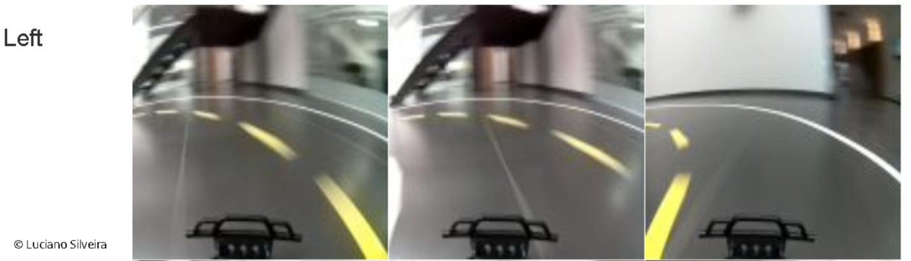

# RoboND-RoboticInference-Project-P5
Robotic Inference Udacity Project using NVIDIA Digits 6.1

## Abstract

The objective of the project is to implement a classification system for a robotic application.

It builds an inference engine extracting information from a race truck.

The data was collected using a [donkeycar2 robocar](http://www.donkeycar.com/) following a standard track.

The trained model uses [NVIDIA DIGITS](https://docs.nvidia.com/deeplearning/digits/digits-installation/index.html) infraestructure to classify if the rover needs to go: straight, turn left or right.

## Introduction

In the last few year the development of robotics applications using Machine Learning framework has exploded.

This project explores the usage of NVIDIA's DIGITS software to be used as an inference engine.

Two models where built using the software; the first one using the standard dataset provided by Udacity to get used to the software, parameters and so on. Then, another model to be used with the collected data for the specific robocar usage, a classifier to detect a robot within a truck and the possible actions to do: go Staight, turn Left or Right.

## Background

This project was entirely resolved using Udacity's workspace and the NVIDIA DIGITS system using Caffe as backend.

The first model builds a classifier capable of discriminating between three classes at roughly 75% accuracy with a latency of no more than 10ms.

The second step was to use or own inference system.

### Bottles and Boxes

For the first part of the project, the images provided are 256x256 RGB images.

The training was done with 30 epochs with Google LeNet and the SGD Optimizer.

 * Model: GoogLeNet
 * Epochs: 10
 * Learning Rate: 0.01
 
Once the training was done, the Udacity `evaluate` command was executed.


### Directions Classifier

Next, using GoogLenet model with same parameters was used for the second classifier. The focus was to build an inference system for identifying 3 possible classes:

 * Straight
 * Left
 * Right

## Data Acquisition

### Bottles and Boxes

The data was already provided from [here](https://s3-us-west-1.amazonaws.com/udacity-robotics/Content+Workspace+Use/lab_data.tar.gz).

### Directions Classifier

For this phase a robocar was run to follow a standard race track in recording mode. After a few laps generation thousand of images the process finished.

Then, a subset was classified in the 3 classes assigned. The dataset can be validated on the [data](data) folder. It includes the training data organized as follows:

```
data/
├── Left/
│   ├── 47_cam-image_array_.jpg
│   ├── ...
│   └── 48_cam-image_array_.jpg
├── Right/
│   ├── 46_cam-image_array_.jpg
│   ├── ...
│   └── 47_cam-image_array_.jpg
└── Straight/
    ├── 25_cam-image_array_.jpg
    ├── ...
    └── 26_cam-image_array_.jpg
```

The number of image is as follows:

 * Left: 702 images
 * Right: 719 images
 * Straight: 841 images

The validation set including a [imagelist.txt](data/imagelist.txt) validation file.

Some classification examples

** Right **


** Left **


** Straight **


## Results

### Bottles and Boxes

### Directions Classifier

#### Preliminary sample Results




#### More Results


#### Training Results


## Discussion

Wrong results:


## Conclusion / Improvements


### Links:
[detectnet](https://devblogs.nvidia.com/detectnet-deep-neural-network-object-detection-digits/)
[Digits Getting Started](https://github.com/NVIDIA/DIGITS/blob/digits-6.0/docs/GettingStarted.md)
[Digits Classification](https://github.com/NVIDIA/DIGITS/blob/master/examples/classification/README.md)
